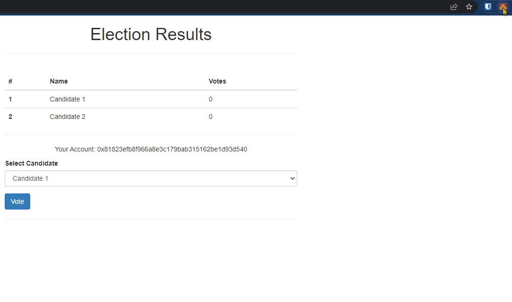

# Intro

### Problem

Voting isn't a transparent process. People cast their votes either online, via mail or in person, but what happens after that?

People have to trust the system that the system counts the votes correctly, withount interference.

Voting fraud can easily be commited.

### Solution

Instead of the existing methods of voting, people will be able to vote via their crypto wallets and have their votes recorded on a blockchain.

Voting now becomes orders of magnitued harder to be tampered with, and vote counts are now transparent.

# Code

### Prerequisites

- NodeJs > 14
- Truffle (global install)
- Ganache
- Metamask

### Voting

First start `Ganache`.

Then add `Ganache` as a network in `Metamask` (`Settings` > `Networks` > `Add Network`).

Then import one of your `Ganache` accounts into `Metamask`.

Now you should have plenty of ETH to vote 🙂

Then do an npm install and run the truffle migration:

```shell
npm i

truffle migrate
```

Now let's start the website:

```shell
npm run dev
```

You should now be able to pick a candidate and cast your vote.

Metamask will pop up so you can confirm the transaction.




### Tests

To run the tests:
```shell
truffle test

  Contract: Election
    ✔ should initialize with two candidates
    ✔ should add expected candidates
    ✔ should allow voter to cast first vote
    ✔ should throw on invalid candidate
    ✔ should throw on double vote attempt

  5 passing
```